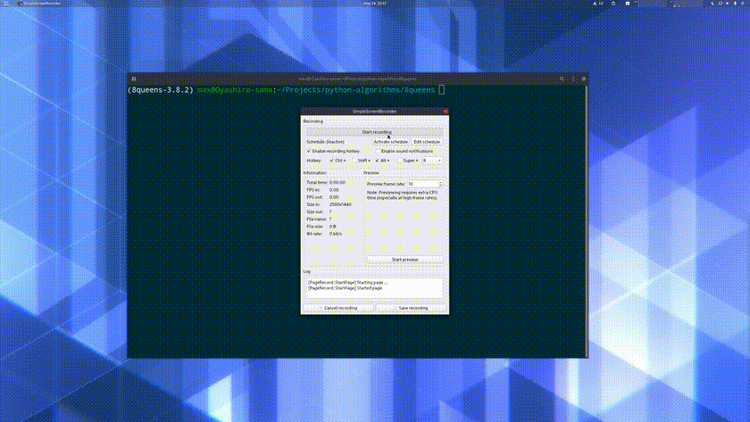

# 8queens
Python solution for [eight queens puzzle](https://en.wikipedia.org/wiki/Eight_queens_puzzle) with graphical representation of found solution(s).



## Usage
This repository consists of two packages:
- `eightqueens` - core of the algorithm, performing the search for indicated configuration
- `gui` - graphical interface, representing found solutions on a board taken from for events sent by `eightqueens`

They both can run standalone, but it's best to run them in parallel in order to see human-friendly representation of found solution.

### Installation
In order to run the `gui` package, pygame library of version specified in `requirements.txt` is required. Install it inside environment of your choice by running:
```commandline
pip install -r requirements.txt
``` 

### Running
`demo.py` contains a wrapper function that allows to easily run the algorithm alongside with its GUI:

`def eight_queens(n: int, find_all: bool = True, visualize: bool = False)`
- `n` is the size of a chessboard,
- `find_all` is a switch between returning all possible solutions and only the first found
- `visualize` determines whether visualization will be run.

In order to see a solutions for classic, 8-fields-sized board, run:
```python
import demo.py
demo.eightqueens(8, True, True)
```
or run `demo.py` as a script using its `__main__` function:
```commandline
python demo.py
``` 
and browse through available solutions using ⬅️ and ➡️ keys.

For running the algorithm without the visualization, run:
```python
import demo.py
demo.eightqueens(8, True, False)
```

In both cases, solution in form of `n` integers will be printed to stdout. Each represents the row (numbered from 1 to 8, bottom to top) of a single column, moving from the left to the right side of the board.

If only the very first found solution should be returned, run:
```python
import demo.py
demo.eightqueens(8, False, False)
```